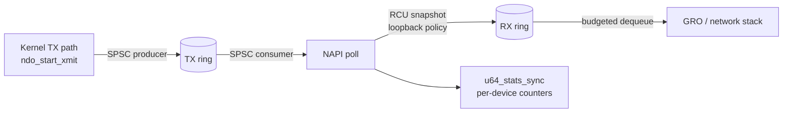

# lockless-nic-driver

An enterprise-oriented Linux kernel networking project that implements a **virtual `net_device`** with a lock-less packet datapath. The driver is structured as a production-grade baseline for **NAPI polling**, **RCU-protected configuration**, **cacheline-aware state**, **single-producer/single-consumer ring buffers**, explicit **acquire/release memory ordering**, bounded backpressure, ethtool observability, and controlled teardown.

> Production use still requires the target-kernel release gate, signed artifacts, live load/unload testing, stress testing, and operational approval described below. Never load an unsigned or unreviewed kernel module on a production host.

## Core objectives

The driver creates an interface named `lnic0` and routes transmit work through a bounded TX ring. The NAPI poller consumes TX entries in batches, optionally mirrors them to an RX ring, and delivers received packets through GRO. The fast path contains no mutex or spinlock; correctness comes from explicit ownership and a strict SPSC contract.

The project deliberately makes synchronization reviewable. The producer publishes a packet slot before releasing the `head` cursor. The consumer acquires `head`, consumes and clears the slot, and releases `tail`. Runtime configuration is read through RCU, while packet counters use `u64_stats_sync` so readers do not observe torn 64-bit values.

## Repository architecture

```text
lockless-nic-driver/
├── .github/workflows/         # CI/CD automation
│   └── kernel-build.yml       # Builds against multiple kernel versions
├── src/                       # Organized kernel source directory
│   ├── lockless_nic.h         # Core types and cacheline-aware state
│   ├── lockless_nic_main.c    # net_device, NAPI, RCU, lifecycle
│   ├── lockless_ring_buffer.c # SPSC ring and memory barriers
│   └── Makefile               # Standard external-module kbuild file
├── scripts/                   # Performance and verification tools
│   ├── setup_netns.sh         # Isolated namespace and veth setup
│   ├── test_throughput.sh     # iperf3 or kernel pktgen benchmark
│   ├── sign_module.sh         # Target-kernel module signing helper
│   └── production_gate.sh     # Exact-kernel release and signing gate
├── tests/                     # Safety and validation files
│   ├── Kconfig.debug          # Lockdep/KCSAN/KASAN/RCU debug fragment
│   └── test_ring.c            # Dependency-free C11 SPSC stress test
├── .clang-format              # Linux-kernel-oriented formatting rules
├── .gitignore                 # Generated artifact exclusions
├── LICENSE                    # GPL-2.0
└── README.md                  # Architectural and operational guide
```

## Concurrency architecture



| Mechanism | Implementation | Invariant |
|---|---|---|
| **Lock-less queueing** | Bounded SPSC ring with monotonic cursors | One writer owns `head`; one writer owns `tail` |
| **Memory ordering** | `smp_store_release()` and `smp_load_acquire()` | Cursor publication happens after slot initialization |
| **RCU** | `rcu_dereference()` and `synchronize_rcu()` | A configuration object is freed only after readers leave |
| **NAPI** | `netif_napi_add()`, `napi_schedule()`, `napi_complete_done()` | Packet processing is batched and budgeted |
| **Cache locality** | `____cacheline_aligned_in_smp` cursor fields | Producer and consumer cursor writes avoid false sharing |
| **Statistics** | `u64_stats_sync` plus ethtool strings/stats | Operators can inspect packet, drop, ring, and poll counters |

### Ring ownership

The TX ring has one producer, `ndo_start_xmit`, and one consumer, the NAPI poller. The RX ring has one producer, the NAPI TX-drain path, and one consumer, the same poller. This is intentionally **SPSC**, not a general multi-producer queue. Adding another producer requires a new algorithm or an explicit serialization boundary.

Each `skb` has one owner at a time. The TX path owns an skb until enqueue succeeds. The ring owns it after publication. NAPI owns it after dequeue. In loopback mode ownership moves to the RX ring and then to the network stack through `napi_gro_receive()`. Every failure path frees the skb exactly once.

### RCU lifecycle

The configuration pointer is read inside `rcu_read_lock()` and dereferenced with `rcu_dereference()`. An eventual control-plane update must allocate and fully initialize a replacement, publish it with `rcu_replace_pointer()`, wait for a grace period, and only then free the old object. Teardown follows the same rule before ring storage and configuration memory are reclaimed.

### NAPI lifecycle

The transmit method only enqueues and schedules NAPI. The poll method drains TX, processes loopback RX entries up to its budget, and calls `napi_complete_done()` only when work is no longer pending. Teardown disables NAPI before the rings are destroyed, preventing the poller from accessing reclaimed memory.

## Build and load

Build against a matching kernel build tree. The source Makefile defaults to the running kernel but accepts an explicit `KDIR` value.

```bash
make -C src
# or:
make -C src KDIR=/lib/modules/$(uname -r)/build

sudo insmod src/lockless_nic.ko ring_order=12 loopback=1
ip link show lnic0
sudo ip link set lnic0 up

# Inspect driver and enterprise counters
sudo ethtool -i lnic0
sudo ethtool -S lnic0
```

Unload the module with:

```bash
sudo ip link set lnic0 down || true
sudo rmmod lockless_nic
```

The module parameters are shown below.

| Parameter | Default | Meaning |
|---|---:|---|
| `ring_order` | `12` | Ring capacity is `2^ring_order`; valid range is 1–20 |
| `loopback` | `1` | Mirror TX packets into the RX ring |

## Isolated network namespace

The namespace helper creates an isolated environment with the virtual NIC and a veth peer. Run it as root on a disposable host:

```bash
sudo ./scripts/setup_netns.sh
```

The default names and addresses can be changed through environment variables such as `LNIC_NETNS`, `LNIC_IFACE`, `VETH_HOST`, `VETH_PEER`, `LNIC_ADDR`, and `PEER_ADDR`. Press `Ctrl-C` to tear down the namespace and unload the module.

## Throughput testing

The benchmark helper supports either `iperf3` or the kernel `pktgen` interface. For `iperf3`, start a server on a peer reachable through the isolated environment and provide its address:

```bash
sudo iperf3 -s
IFACE=lnic0 TARGET=192.0.2.2 MODE=iperf3 \
  sudo -E ./scripts/test_throughput.sh
```

For a kernel-level packet-generation run:

```bash
sudo MODE=pktgen IFACE=lnic0 PACKETS=1000000 PKT_SIZE=64 \
  ./scripts/test_throughput.sh
```

The helper prints `ip -s link` counters before and after the test. It does not claim a throughput number when the selected traffic generator is unavailable; it exits with an actionable error instead.

## Enterprise production release gate

A release build must use the exact target kernel build tree and a complete `Module.symvers`. Run the gate from the repository root after configuring the target kernel’s module-signing policy:

```bash
KDIR=/lib/modules/$(uname -r)/build \
MODULE=src/lockless_nic.ko \
REQUIRE_SIGNATURE=1 \
./scripts/production_gate.sh
```

The gate rejects missing target configuration, missing symbol-version data, warnings-as-errors failures, vermagic mismatches, and unsigned modules. The private signing key must remain in a secure build service or hardware-backed key store; it must never be committed to this repository. Sign the module with the target kernel’s `scripts/sign-file` helper:

```bash
KDIR=/lib/modules/$(uname -r)/build \
SIGNING_KEY=/secure/keys/module.key \
SIGNING_CERT=/secure/keys/module.x509 \
MODULE=src/lockless_nic.ko \
./scripts/sign_module.sh
```

Then rerun `production_gate.sh` with `REQUIRE_SIGNATURE=1` and verify with `modinfo` before installation. Linux module signing and enforcement are kernel policy controls, not repository-only features [5].

## Validation

The user-space stress test validates the same SPSC acquire/release protocol without requiring kernel headers:

```bash
gcc -std=c11 -O2 -Wall -Wextra -Werror -pthread \
  tests/test_ring.c -o /tmp/lockless-ring-test
/tmp/lockless-ring-test
```

The CI workflow compiles and packages the module against Linux `5.15`, `6.1`, and `6.6` kernel trees, runs the C11 stress test, checks shell syntax, and validates formatting. Locally, the module compiled successfully against a prepared Ubuntu Linux 6.8 source tree, and sparse analysis completed successfully. The local build used `KBUILD_MODPOST_WARN=1` because the disposable source tree did not contain a full-kernel `Module.symvers`; that option is appropriate for source/API validation, not for a production release. Because CI prepares source trees rather than booting each kernel, module loading and live datapath testing must still be performed on a matching disposable kernel. `tests/Kconfig.debug` documents a disposable debug-kernel baseline for Lockdep, KCSAN, KASAN, RCU tracing, frame pointers, and debug information.

## Review checklist

Before changing the datapath, verify that each ring still has exactly one producer and one consumer, that a slot is initialized before `head` is released, that a slot is cleared before `tail` is released, that RCU-protected objects outlive all readers, that NAPI is disabled before ring reclamation, and that every packet has a single owner through success and failure paths.

## Production deployment gate

A production deployment must build against the exact target kernel’s prepared build tree, matching configuration, compiler policy, and `Module.symvers`; it must then pass module-signature policy, `modinfo` vermagic checks, a disposable load/unload test, namespace traffic tests, and a sustained throughput run under the target kernel. This sandbox cannot honestly claim the final live-load gate because its running kernel is `6.18.38+` without matching headers, while the locally compiled artifact targets Linux 6.8. The module should therefore be treated as **source-validated and production-hardened in structure, but not production-certified until those target-kernel tests pass**.

## References

[1]: https://docs.kernel.org/networking/napi.html "Linux kernel NAPI documentation"
[2]: https://docs.kernel.org/RCU/index.html "Linux kernel RCU Handbook"
[3]: https://www.kernel.org/doc/Documentation/memory-barriers.txt "Linux kernel memory barriers documentation"
[4]: https://docs.kernel.org/process/coding-style.html "Linux kernel coding style"
[5]: https://www.kernel.org/doc/html/latest/admin-guide/module-signing.html "Linux kernel module signing facility"
[6]: https://docs.kernel.org/dev-tools/kcsan.html "Linux Kernel Concurrency Sanitizer"
[7]: https://docs.kernel.org/networking/index.html "Linux kernel networking documentation"

The synchronization, lifecycle, security, and observability design follows the official Linux kernel documentation for NAPI [1], RCU [2], memory barriers [3], coding style [4], module signing [5], KCSAN [6], and networking APIs [7].
